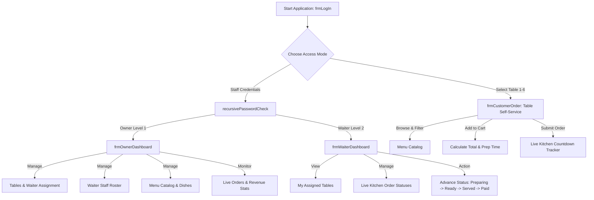

# 🍽️ Restaurant Management Suite (v4 Recursion)

[](https://learn.microsoft.com/en-us/dotnet/visual-basic/)
[](https://dotnet.microsoft.com/download/dotnet-framework/net472)
[-008080.svg)](https://support.microsoft.com/en-us/office/introduction-to-access-databases)
[](#-recursive-authentication-algorithm)
[](#)

A desktop restaurant automation and point-of-sale (POS) system built using **VB.NET**, **Windows Forms**, and **Microsoft Access Database (OLEDB)**. The application features multi-role security authentication (Owner, Waiter, and Customer Table Portal), automated table assignment, dynamic menu management, an intelligent order-queuing system with real-time countdown tracking, and a **recursive authentication verification engine**.

---

## 📑 Table of Contents

- [🌟 System Highlights & Key Features](#-system-highlights--key-features)
- [👥 User Portals & Workflow Architecture](#-user-portals--workflow-architecture)
  - [1. Staff Login & Multi-Role Gateway](#1-staff-login--multi-role-gateway)
  - [2. Owner / Manager Administrative Dashboard](#2-owner--manager-administrative-dashboard)
  - [3. Waiter Service Station](#3-waiter-service-station)
  - [4. Customer / Table Self-Service Portal](#4-customer--table-self-service-portal)
- [🔄 Recursive Authentication Algorithm](#-recursive-authentication-algorithm)
- [🗄️ Database Architecture & Data Dictionary](#️-database-architecture--data-dictionary)
  - [Database Connection & Automatic Initialization](#database-connection--automatic-initialization)
  - [Table Schemas](#table-schemas)
- [🔑 Default Credentials & Demo Accounts](#-default-credentials--demo-accounts)
- [💻 Prerequisites & System Requirements](#-prerequisites--system-requirements)
- [🚀 How to Build & Run](#-how-to-build--run)
  - [Method 1: One-Click Launcher (`run_restaurant.bat`)](#method-1-one-click-launcher-run_restaurantbat-recommended)
  - [Method 2: Visual Studio (2017 / 2019 / 2022)](#method-2-visual-studio-2017--2019--2022)
  - [Method 3: Visual Studio Code](#method-3-visual-studio-code)
  - [Method 4: Command Line (MSBuild)](#method-4-command-line-msbuild)
- [📂 Project Structure](#-project-structure)
- [🔧 Troubleshooting & FAQs](#-troubleshooting--faqs)

---

## 🌟 System Highlights & Key Features

- **Multi-Role User Access Control**: Three purpose-built user interfaces tailored for Owners, Waiters, and Table Diners.
- **Academic Recursion Engine**: Implements a dedicated recursive verification algorithm (`recursivePasswordCheck`) with state tracking and security lockouts.
- **Dynamic Table Allocation**: Tables 1 through 6 with seat capacities (2, 4, 6, 8 seats) and real-time statuses (`Free`, `Occupied`, `Reserved`).
- **Real-Time Food Preparation Countdown**: Calculates estimated kitchen wait times using dish prep algorithms (`Max(Dish Prep Times) + Queuing Offset`) and renders real-time countdown progress bars.
- **Comprehensive Order Lifecycle**: Kitchen status progression from `Preparing in Kitchen` ➔ `Ready to Serve` ➔ `Served to Customer` ➔ `Completed / Paid`.
- **Automatic Self-Seeding Database**: Detects database state on startup; automatically creates required tables and seeds default staff, tables, and menu dishes if empty.
- **Base64 Security Encryption**: Staff passwords are encrypted prior to database persistence and decrypted during verification.
- **Fail-Safe Database Resolution**: Dynamically resolves the database location across application startup paths, `bin\Debug`, or parent project directories.

---

## 👥 User Portals & Workflow Architecture



### 1. Staff Login & Multi-Role Gateway
- File: [frmLogIn.vb](file:///Users/aravindr/Downloads/Restaurant%20-%20V4%20Recursion/RestaurantManagement/frmLogIn.vb)
- Unified entry point for staff authentication and direct customer table entry.
- Direct table selector allowing patrons or host staff to launch table-specific ordering sessions.

### 2. Owner / Manager Administrative Dashboard
- File: [frmOwnerDashboard.vb](file:///Users/aravindr/Downloads/Restaurant%20-%20V4%20Recursion/RestaurantManagement/frmOwnerDashboard.vb)
- **Table Management**: View all restaurant tables, current occupancy, and assign designated waiters.
- **Staff Roster**: Add new wait staff with phone number, username, encrypted password, and salary; remove former staff with auto-cleanup of active table assignments.
- **Menu Catalog**: Create new dishes with category (`Starters`, `Mains`, `Desserts`, `Beverages`), unit price, kitchen preparation duration in minutes, and ingredients description.
- **Sales & Operations Analytics**: Live summary showing total gross revenue, count of active preparing/serving orders, and full historical order logs.

### 3. Waiter Service Station
- File: [frmWaiterDashboard.vb](file:///Users/aravindr/Downloads/Restaurant%20-%20V4%20Recursion/RestaurantManagement/frmWaiterDashboard.vb)
- Shows only the tables assigned to the currently logged-in waiter.
- **Live Order Stream**: Filtered order view showing active orders for the waiter's tables with itemized dish breakdowns.
- **One-Click Food Workflow Buttons**:
  - `Set Preparing in Kitchen 👨‍🍳`
  - `Set Ready to Serve 🍽️`
  - `Set Served to Customer ✅`
  - `Set Completed / Paid 💵` (automatically resets the table status back to `Free`).
- **Direct Table Take Order**: Enables wait staff to place orders on behalf of seated customers.

### 4. Customer / Table Self-Service Portal
- File: [frmCustomerOrder.vb](file:///Users/aravindr/Downloads/Restaurant%20-%20V4%20Recursion/RestaurantManagement/frmCustomerOrder.vb)
- **Interactive Menu Browser**: Filterable by category (`All Categories`, `Starters`, `Mains`, `Desserts`, `Beverages`).
- **Order Cart**: Real-time line item quantity tracking, price subtotal calculation, and estimated cook time estimation.
- **Live Kitchen Status Tracker**:
  - Shows assigned waiter name and total bill.
  - Color-coded status badge with real-time state alerts.
  - Visual progress bar that tracks cooking elapsed time vs. estimated cook duration.
  - Itemized dish prep checklist.

---

## 🔄 Recursive Authentication Algorithm

The system satisfies the academic requirement for **recursion** through its recursive authentication engine implemented in [frmLogIn.vb](file:///Users/aravindr/Downloads/Restaurant%20-%20V4%20Recursion/RestaurantManagement/frmLogIn.vb#L60-L84).

### Algorithm Design:
1. **Base Case 1 (Success)**: When `UserPw = RetrievedPW`, authentication succeeds, session state is updated (`LogedIn = True`), and execution terminates returning `True`.
2. **Base Case 2 (Lockout)**: When failed attempts reach `3`, a security warning dialog is presented, access is locked, and execution terminates returning `False`.
3. **Recursive Step**: If the entered password is incorrect and attempts remain `< 3`, an input dialog prompts the user for retry with current attempt count indicators (`Attempt 2 of 3`, `Attempt 3 of 3`), calling `recursivePasswordCheck(failedAttempts, newAttempt, RetrievedPW)` recursively.

```vb
Public Function recursivePasswordCheck(AttemptCount As Integer, UserPw As String, RetrievedPW As String) As Boolean
    If UserPw = RetrievedPW Then
        ' Base Case 1: Match found
        LogedIn = True
        Return True
    End If

    ' Track failed attempt count (1st attempt failed = 1)
    Dim failedAttempts As Integer = AttemptCount + 1
    If failedAttempts >= 3 Then
        ' Base Case 2: Maximum attempts exhausted
        MessageBox.Show("You have reached 3 failed login attempts. Access is temporarily locked.",
                        "Security Notice", MessageBoxButtons.OK, MessageBoxIcon.Warning)
        LogedIn = False
        Return False
    End If

    ' Recursive Step: Prompt retry and re-invoke
    Dim newAttempt As String = InputBox("Invalid password. Please re-enter password." & vbCrLf &
                                        "Attempt " & (failedAttempts + 1) & " of 3:", "Authentication Retry")
    If String.IsNullOrEmpty(newAttempt) Then
        LogedIn = False
        Return False
    End If

    txtPassword.Text = newAttempt
    Return recursivePasswordCheck(failedAttempts, newAttempt, RetrievedPW)
End Function
```

---

## 🗄️ Database Architecture & Data Dictionary

### Database Connection & Automatic Initialization
- Database engine: **Microsoft Access (`RestaurantDB.mdb`)**
- Driver compatibility: Dual fallback to **Microsoft Jet 4.0** (`Microsoft.Jet.OLEDB.4.0`) and **Microsoft ACE 12.0** (`Microsoft.ACE.OLEDB.12.0`).
- Managed centrally in [ModMain.vb](file:///Users/aravindr/Downloads/Restaurant%20-%20V4%20Recursion/RestaurantManagement/ModMain.vb).
- `InitializeDatabase()` creates tables dynamically via DDL if they do not exist and populates initial records if the database is newly created.

### Table Schemas

#### 1. `tblStaff`
Stores administrative staff and waiter credentials.
| Field Name | Data Type | Constraint | Description |
| :--- | :--- | :--- | :--- |
| `StaffID` | AUTOINCREMENT | Primary Key | Unique employee identifier |
| `UserName` | TEXT(50) | Not Null | Staff username for login |
| `UnPassword` | TEXT(100) | Not Null | Base64-encrypted password string |
| `AccessLevel` | INTEGER | Not Null | `1` = Owner, `2` = Waiter, `99` = Guest |
| `FullName` | TEXT(100) | | Full name of staff member |
| `Role` | TEXT(50) | | Role designation (`Owner`, `Waiter`) |
| `Phone` | TEXT(50) | | Contact phone number |
| `Salary` | CURRENCY | | Annual salary figure |

#### 2. `tblTables`
Maintains restaurant floor tables and waiter assignments.
| Field Name | Data Type | Constraint | Description |
| :--- | :--- | :--- | :--- |
| `TableID` | AUTOINCREMENT | Primary Key | Unique table ID |
| `TableNumber` | INTEGER | Not Null | Physical table identifier (1–6) |
| `Capacity` | INTEGER | | Seating capacity (2, 4, 6, 8) |
| `TableStatus` | TEXT(30) | | `Free`, `Occupied`, or `Reserved` |
| `AssignedWaiterID` | INTEGER | | StaffID of the assigned waiter |
| `AssignedWaiterName`| TEXT(100) | | Display name of the assigned waiter |

#### 3. `tblMenuItems`
Stores the food and beverage catalog with recipe steps and ingredients.
| Field Name | Data Type | Constraint | Description |
| :--- | :--- | :--- | :--- |
| `ItemID` | AUTOINCREMENT | Primary Key | Unique menu item ID |
| `ItemName` | TEXT(100) | Not Null | Name of the dish |
| `Category` | TEXT(50) | Not Null | `Starters`, `Mains`, `Breads`, `Rice`, `Desserts`, `Beverages` |
| `Price` | CURRENCY | Not Null | Unit price in British Pounds (£) |
| `PrepTimeMinutes` | INTEGER | Not Null | Estimated kitchen preparation duration |
| `Description` | TEXT(255) | | Culinary description and flavor profile |
| `Ingredients` | TEXT(255) | | Detailed ingredient list for allergy & dietary checks |
| `Recipe` | TEXT(255) | | Culinary preparation steps and chef instructions |

#### 4. `tblOrders`
Header record for customer orders.
| Field Name | Data Type | Constraint | Description |
| :--- | :--- | :--- | :--- |
| `OrderID` | AUTOINCREMENT | Primary Key | Unique order number |
| `TableNumber` | INTEGER | Not Null | Table number associated with the order |
| `CustomerName` | TEXT(100) | | Table diner identification |
| `WaiterID` | INTEGER | | ID of serving waiter |
| `WaiterName` | TEXT(100) | | Name of serving waiter |
| `OrderStatus` | TEXT(30) | | `Preparing in Kitchen`, `Ready to Serve`, `Served to Customer`, `Completed / Paid` |
| `OrderTime` | DATETIME | | Timestamp when order was placed |
| `EstWaitMinutes` | INTEGER | | Total calculated cook duration |
| `TotalAmount` | CURRENCY | | Total bill amount |
| `Notes` | TEXT(255) | | Special dining requests / instructions |

#### 5. `tblOrderItems`
Line items associated with each order header, including customer-specific customization wishes.
| Field Name | Data Type | Constraint | Description |
| :--- | :--- | :--- | :--- |
| `DetailID` | AUTOINCREMENT | Primary Key | Unique item line ID |
| `OrderID` | INTEGER | Foreign Key | References `tblOrders(OrderID)` |
| `ItemID` | INTEGER | | References `tblMenuItems(ItemID)` |
| `ItemName` | TEXT(100) | | Dish name snapshot |
| `Quantity` | INTEGER | | Units ordered |
| `UnitPrice` | CURRENCY | | Unit price snapshot in British Pounds (£) |
| `SubTotal` | CURRENCY | | Line subtotal (`Quantity * UnitPrice`) |
| `ItemStatus` | TEXT(30) | | Kitchen status of specific dish item |
| `Customization` | TEXT(255) | | Customer's specific wish (e.g., extra spicy, no onion, Jain style) |

#### 6. `tblCustomers`
Customer registry for loyalty tracking, dietary preferences, and visit history.
| Field Name | Data Type | Constraint | Description |
| :--- | :--- | :--- | :--- |
| `CustomerID` | AUTOINCREMENT | Primary Key | Unique customer ID |
| `CustomerName` | TEXT(100) | Not Null | Customer's full name |
| `Phone` | TEXT(50) | | Contact phone number (+44...) |
| `Email` | TEXT(100) | | Email address |
| `Address` | TEXT(255) | | Street address (UK / International) |
| `City` | TEXT(100) | | City (default: London) |
| `VisitCount` | INTEGER | | Number of dining visits |
| `TotalSpent` | CURRENCY | | Total dining expenditure in British Pounds (£) |
| `RegisteredOn` | DATETIME | | Date and time customer was registered |
| `Notes` | TEXT(255) | | Dietary preferences, allergies, VIP notes |

---

## 🔑 Default Credentials & Demo Accounts

The database comes pre-seeded with sample records for immediate testing:

### Staff Accounts
| Role | Username | Password | Full Name | Access Level |
| :--- | :--- | :--- | :--- | :--- |
| **Owner / Manager** | `owner` | `admin123` | James Sterling (Owner) | Level 1 (Full Admin) |
| **Admin / Manager** | `admin` | `admin123` | System Administrator | Level 1 (Full Admin) |
| **Head Waiter** | `waiter1` | `waiter123` | Oliver Smith | Level 2 (Assigned Tables 1 & 2) |
| **Waiter 2** | `waiter2` | `waiter123` | Emily Davies | Level 2 (Assigned Tables 3 & 4) |
| **Waiter 3** | `waiter3` | `waiter123` | Arjun Singh | Level 2 (Assigned Tables 5 & 6) |

### Table Testing
- Tables **1 to 6** are available directly on the login screen under **Customer / Table Self-Service**.
- Table 1 has a pre-seeded active order placed in the kitchen so you can immediately view the live status countdown and item tracker.

---

## 💻 Prerequisites & System Requirements

- **Operating System**: Windows 7, 8.1, 10, or 11 (32-bit or 64-bit).
- **.NET Framework**: Version **4.7.2** or higher (pre-installed on Windows 10 version 1803+ and all Windows 11 releases).
- **Database Engine Driver**:
  - 32-bit `Microsoft.Jet.OLEDB.4.0` is built directly into all Windows installations.
  - The project configuration is set to `<Prefer32Bit>true</Prefer32Bit>` to ensure out-of-the-box database connectivity on 64-bit Windows without installing external runtimes.
- **Build Tools** (any of the following):
  - Visual Studio 2017, 2019, or 2022 (Community, Professional, or Enterprise) with *.NET desktop development* workload.
  - Or standalone Visual Studio Build Tools.
  - Or standard Microsoft .NET Framework MSBuild (`C:\Windows\Microsoft.NET\Framework\v4.0.30319\MSBuild.exe`).

---

## 🚀 How to Build & Run

### Method 1: One-Click Launcher (`run_restaurant.bat`) (Recommended)

A root batch script [run_restaurant.bat](file:///Users/aravindr/Downloads/Restaurant%20-%20V4%20Recursion/run_restaurant.bat) is provided. It automatically locates the appropriate `MSBuild.exe` on your system (checking .NET Framework, VS 2022, and VS 2019 locations), compiles the application, and starts the executable:

1. Double-click `run_restaurant.bat` in the project root folder.
2. The compiler will build the project and launch `RestaurantManagement.exe`.

---

### Method 2: Visual Studio (2017 / 2019 / 2022)

1. Double-click [RestaurantManagement.sln](file:///Users/aravindr/Downloads/Restaurant%20-%20V4%20Recursion/RestaurantManagement.sln) to open the solution in Visual Studio.
2. Ensure the build configuration is set to **Debug** or **Release** and platform is **Any CPU**.
3. Press **F5** (or click **Start Debugging** ▶️).

---

### Method 3: Visual Studio Code

The repository includes pre-configured tasks in [.vscode/tasks.json](file:///Users/aravindr/Downloads/Restaurant%20-%20V4%20Recursion/.vscode/tasks.json) and debug configurations in [.vscode/launch.json](file:///Users/aravindr/Downloads/Restaurant%20-%20V4%20Recursion/.vscode/launch.json):

1. Open the project folder in VS Code.
2. Press `Ctrl + Shift + B` (or `Cmd + Shift + B`) to run the default build task **Build Restaurant Management (Default)**.
3. Press `F5` to launch and debug the application.

---

### Method 4: Command Line (MSBuild)

Open **Developer Command Prompt for Visual Studio** (or standard Windows Command Prompt) and run:

```cmd
:: Build the project
"C:\Windows\Microsoft.NET\Framework\v4.0.30319\MSBuild.exe" "RestaurantManagement\RestaurantManagement.vbproj" /p:Configuration=Debug /p:Platform=AnyCPU

:: Launch the executable
cd RestaurantManagement\bin\Debug
RestaurantManagement.exe
```

---

## 📂 Project Structure

```text
Restaurant - V4 Recursion/
├── .vscode/
│   ├── launch.json                   # Visual Studio Code debugger launch configuration
│   └── tasks.json                    # Visual Studio Code build and run tasks
├── RestaurantManagement/
│   ├── My Project/
│   │   ├── Application.myapp         # VB Application settings (sets frmLogIn as startup form)
│   │   ├── Application.Designer.vb   # Application initialization code
│   │   ├── AssemblyInfo.vb           # Assembly metadata and versioning
│   │   ├── Resources.resx            # Project resource container
│   │   ├── Resources.Designer.vb     # Strongly typed resource wrapper
│   │   ├── Settings.settings         # Application settings profile
│   │   └── Settings.Designer.vb      # Strongly typed settings wrapper
│   ├── App.config                    # Runtime framework configuration (targets .NET 4.7.2)
│   ├── ModMain.vb                    # Central business logic, OLEDB connection, DDL & encryption
│   ├── RestaurantDB.mdb              # Microsoft Access database store
│   ├── RestaurantManagement.vbproj   # VB.NET Project file (MSBuild schema)
│   ├── frmLogIn.vb                   # Login logic with recursive authentication check
│   ├── frmLogIn.Designer.vb          # Login form layout & controls
│   ├── frmOwnerDashboard.vb          # Owner dashboard (tables, waiters, menu catalog, analytics)
│   ├── frmOwnerDashboard.Designer.vb # Owner dashboard layout & data grids
│   ├── frmWaiterDashboard.vb         # Waiter dashboard (assigned tables, kitchen workflow)
│   ├── frmWaiterDashboard.Designer.vb# Waiter dashboard layout & controls
│   ├── frmCustomerOrder.vb           # Table self-service ordering & live countdown tracker
│   ├── frmCustomerOrder.Designer.vb  # Customer ordering layout & menu view
│   ├── frmStaffEdit.vb               # Register new wait staff modal dialog
│   ├── frmStaffEdit.Designer.vb      # Staff registration layout
│   └── bin/
│       └── Debug/
│           └── RestaurantDB.mdb      # Deployed database accessed by runtime binary
├── RestaurantManagement.sln          # Visual Studio solution file
├── run_restaurant.bat                # Automated compile and launch batch script
└── README.md                         # Project documentation
```

---

## 🔧 Troubleshooting & FAQs

### Q: Why do I get *"The 'Microsoft.Jet.OLEDB.4.0' provider is not registered on the local machine"*?
> **Answer**: `Microsoft.Jet.OLEDB.4.0` is a 32-bit component native to all Windows installations. If an application runs as a pure 64-bit process without the 64-bit Microsoft Access Database Engine, it cannot load Jet 4.0.
> **Fix**: In this project, `<Prefer32Bit>true</Prefer32Bit>` is configured in `RestaurantManagement.vbproj`, ensuring the application executes under Windows 32-bit WOW64 subsystem where Jet 4.0 is always registered. If you compile using custom tools, ensure the target architecture is set to **x86** or **Any CPU with 32-bit preferred**.

### Q: Where does the application store newly inserted orders, staff, and dishes?
> **Answer**: When running from Visual Studio or `run_restaurant.bat`, the working copy of the database is located in `RestaurantManagement\bin\Debug\RestaurantDB.mdb`. Changes made at runtime persist in that file.

### Q: Can I reset the database back to default sample data?
> **Answer**: Yes. If you delete `RestaurantDB.mdb` or delete all rows in `tblStaff`, `InitializeDatabase()` in [ModMain.vb](file:///Users/aravindr/Downloads/Restaurant%20-%20V4%20Recursion/RestaurantManagement/ModMain.vb#L102) will automatically re-create the tables and re-seed the default owner, waiters, tables, and menu dishes on the next application launch.

---

## 📜 License & Acknowledgments

Developed as a demonstration of **VB.NET Windows Forms**, **Multi-Role Point of Sale Systems**, and **Recursive Algorithm Design**. Feel free to customize and expand for academic or commercial use.
